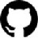

## About The Project

Converts images to ASCII images, runs in the cli and uses rust.

Example input image and its output:

```
. . . . . . . . . . . . . . . . . : = + % @ @ @ @ @ @ % # = : . . . . . . . . . . . . . . . . . 
. . . . . . . . . . . . . . . - + # % @ @ @ @ @ @ @ @ @ @ % # # : . . . . . . . . . . . . . . . 
. . . . . . . . . . . : - + @ @ @ @ @ @ @ @ @ @ @ @ @ @ @ @ @ @ @ @ % - . . . . . . . . . . . . 
. . . . . . . . . . . + @ @ @ @ @ @ @ @ @ @ @ @ @ @ @ @ @ @ @ @ @ @ @ @ + : . . . . . . . . . . 
. . . . . . . . . . = @ @ @ @ @ @ @ @ @ @ @ @ @ @ @ @ @ @ @ @ @ @ @ @ @ @ # . . . . . . . . . . 
. . . . . . . . * @ @ @ @ @ @ @ @ @ @ @ @ @ @ @ @ @ @ @ @ @ @ @ @ @ @ @ @ @ @ * - . . . . . . . 
. . . . . . . : @ @ @ @ @ @ @ @ @ @ @ @ @ @ @ @ @ @ @ @ @ @ @ @ @ @ @ @ @ @ @ @ * . . . . . . . 
. . . . . . : # @ @ @ @ @ @ @ @ @ @ @ @ @ @ @ @ @ @ @ @ @ @ @ @ @ @ @ @ @ @ @ @ @ : . . . . . . 
. . . . . * @ @ @ @ @ @ @ @ @ @ @ @ @ @ @ @ @ @ @ @ @ @ @ @ @ @ @ @ @ @ @ @ @ @ @ @ * : . . . . 
. . . . . @ @ @ @ @ @ @ @ @ @ @ @ @ @ @ @ @ @ @ @ @ @ @ @ @ @ @ @ @ @ @ @ @ @ @ @ @ @ + . . . . 
. . . . = @ @ @ @ @ @ * = + @ @ @ @ @ @ @ @ @ @ @ @ @ @ @ @ @ @ @ @ # = + @ @ @ @ @ @ % . . . . 
. . : + @ @ @ @ @ @ @ : . . . : - % @ @ # * * + + + * # % @ @ * : . . . : + @ @ @ @ @ @ + . . . 
. . - % @ @ @ @ @ @ @ : . . . . . = + + - : . . . . : - = + + : . . . . . = @ @ @ @ @ @ % - . . 
. . + @ @ @ @ @ @ @ @ : . . . . . . . . . . . . . . . . . . . . . . . . . - @ @ @ @ @ @ @ + : . 
. . @ @ @ @ @ @ @ @ @ : . . . . . . . . . . . . . . . . . . . . . . . . . = @ @ @ @ @ @ @ @ + . 
. - @ @ @ @ @ @ @ @ @ : . . . . . . . . . . . . . . . . . . . . . . . . : + @ @ @ @ @ @ @ @ # . 
. + @ @ @ @ @ @ @ @ @ : . . . . . . . . . . . . . . . . . . . . . . . . : + @ @ @ @ @ @ @ @ % . 
: # @ @ @ @ @ @ @ @ # . . . . . . . . . . . . . . . . . . . . . . . . . . : @ @ @ @ @ @ @ @ @ : 
- % @ @ @ @ @ @ @ % - . . . . . . . . . . . . . . . . . . . . . . . . . . . % @ @ @ @ @ @ @ @ - 
+ @ @ @ @ @ @ @ @ # . . . . . . . . . . . . . . . . . . . . . . . . . . . . * @ @ @ @ @ @ @ @ + 
% @ @ @ @ @ @ @ # = . . . . . . . . . . . . . . . . . . . . . . . . . . . . - # @ @ @ @ @ @ @ # 
@ @ @ @ @ @ @ @ # : . . . . . . . . . . . . . . . . . . . . . . . . . . . . . # @ @ @ @ @ @ @ % 
@ @ @ @ @ @ @ @ # . . . . . . . . . . . . . . . . . . . . . . . . . . . . . . * @ @ @ @ @ @ @ % 
@ @ @ @ @ @ @ @ # : . . . . . . . . . . . . . . . . . . . . . . . . . . . . . * @ @ @ @ @ @ @ @ 
@ @ @ @ @ @ @ @ # : . . . . . . . . . . . . . . . . . . . . . . . . . . . . : * @ @ @ @ @ @ @ @ 
@ @ @ @ @ @ @ @ # - . . . . . . . . . . . . . . . . . . . . . . . . . . . . : # @ @ @ @ @ @ @ @ 
@ @ @ @ @ @ @ @ @ + . . . . . . . . . . . . . . . . . . . . . . . . . . . . = % @ @ @ @ @ @ @ % 
% @ @ @ @ @ @ @ @ * . . . . . . . . . . . . . . . . . . . . . . . . . . . . * @ @ @ @ @ @ @ @ # 
# @ @ @ @ @ @ @ @ % : . . . . . . . . . . . . . . . . . . . . . . . . . . . # @ @ @ @ @ @ @ @ * 
= % @ @ @ @ @ @ @ @ % . . . . . . . . . . . . . . . . . . . . . . . . . . : @ @ @ @ @ @ @ @ @ - 
: # @ @ @ @ @ @ @ @ @ : . . . . . . . . . . . . . . . . . . . . . . . . . = @ @ @ @ @ @ @ @ @ : 
. * @ @ @ @ @ @ @ @ @ + . . . . . . . . . . . . . . . . . . . . . . . . = @ @ @ @ @ @ @ @ @ @ . 
. - @ @ @ @ @ @ @ @ @ @ @ * : . . . . . . . . . . . . . . . . . . : = @ @ @ @ @ @ @ @ @ @ @ * . 
. . @ @ @ @ @ # % @ @ @ @ @ * = : . . . . . . . . . . . . . . : - + # @ @ @ @ @ @ @ @ @ @ @ + . 
. . % @ @ @ % - : + @ @ @ @ @ @ % = - : . . . . . . . . . - = * @ @ @ @ @ @ @ @ @ @ @ @ @ % - . 
. . - % @ @ @ @ = . . @ @ @ @ @ @ @ @ + . . . . . . . . . % @ @ @ @ @ @ @ @ @ @ @ @ @ @ % - . . 
. . : + @ @ @ @ # : . * @ @ @ @ @ @ * : . . . . . . . . . + @ @ @ @ @ @ @ @ @ @ @ @ @ @ = : . . 
. . . : # @ @ @ @ * . - * @ @ @ @ @ = . . . . . . . . . . = @ @ @ @ @ @ @ @ @ @ @ @ @ @ : . . . 
. . . . . @ @ @ @ @ * . . : - - - : . . . . . . . . . . . = % @ @ @ @ @ @ @ @ @ @ @ @ + . . . . 
. . . . . + @ @ @ @ % . . . . . . . . . . . . . . . . . . - % @ @ @ @ @ @ @ @ @ @ @ + : . . . . 
. . . . . : * @ @ @ @ = : . . . . . . . . . . . . . . . . - % @ @ @ @ @ @ @ @ @ @ * - . . . . . 
. . . . . . . : @ @ @ @ @ @ % % % # - . . . . . . . . . . - % @ @ @ @ @ @ @ @ @ * . . . . . . . 
. . . . . . . . + @ @ @ @ @ @ @ @ @ - . . . . . . . . . . - % @ @ @ @ @ @ @ @ + : . . . . . . . 
. . . . . . . . : + % @ @ @ @ @ @ @ - . . . . . . . . . . - % @ @ @ @ @ @ @ + : . . . . . . . . 
. . . . . . . . . . . + % @ @ @ @ @ = . . . . . . . . . . - @ @ @ @ @ % + : . . . . . . . . . . 
. . . . . . . . . . . . - + @ @ @ @ - . . . . . . . . . . - % @ @ @ % - . . . . . . . . . . . . 
. . . . . . . . . . . . . : + # % # : . . . . . . . . . . : * @ # + = . . . . . . . . . . . . . 
. . . . . . . . . . . . . . . . . . . . . . . . . . . . . . . . . . . . . . . . . . . . . . . .
```

## Usage

run `cargo run FILENAME` eg `cargo run static/gihub.jpg`
